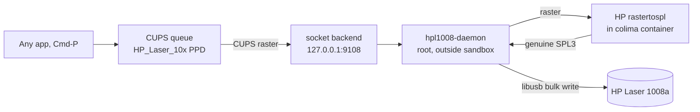

## Quick Verdict

On **August 17-18, 2026**, Hacker News lit up twice over the same project: developer **Kuberwastaken** used **Claude Code** to make the **HP Laser 1008a** — a printer HP never shipped macOS drivers for — work natively from Apple Silicon Macs with plain `Cmd-P` printing. The first thread (149 points) was titled "Claude writing a macOS driver for my obscure HP printer built only for Windows"; a follow-up (82 points, 52 comments) documented the actual result.

The headline is slightly oversold, and the community called it out fast. **Claude Code did not write a printer driver from scratch.** It orchestrated a working solution: take HP's own `rastertospl` codec binary from the **HP Unified Linux Driver**, run it inside a tiny **Linux container (colima)**, bridge CUPS to it via a **root LaunchDaemon**, and deliver the SPL3 stream to the printer over USB via libusb. As `Tiberium` put it in the thread: "It basically used HP's existing proprietary driver in a Linux VM on macOS, and just bridged that to macOS."

That distinction matters — but it does not diminish what happened. The end state is real: a printer that every open-source path (SpliX 2.0.2, foo2zjs, AirPrint, PCL) failed to drive now prints from any macOS app. This article breaks down the exact workflow Claude Code executed, the debugging dead ends, the security trade-offs, and how to replicate the pattern.

## The Problem: A Printer That Speaks Only SPL3

The HP Laser 100 series (1003/1006/1008a/w) is a **rebadged Samsung SPL3 laser printer**. HP never shipped a macOS driver. The hardware is aggressively minimal:

| Approach | Result (from the project README) |
|---|---|
| AirPrint / driverless | Not offered — the printer's USB HTTP endpoint serves no IPP |
| Generic PCL / PostScript | Printer speaks neither — CUPS backend hangs "offline" |
| splix 2.0.1 / 2.0.2 | Garbled: striped raster at page origin, repeated sheets |
| foo2zjs `foo2qpdl` | `SPL ERROR - Please use the proper driver` |
| HP's macOS driver | Does not exist |

The printer literally requests "the proper driver." That driver exists as **x86 and arm64 Linux binaries** (`rastertospl`) inside HP's Unified Linux Driver. It cannot run on macOS directly — but it runs natively in a Linux ARM64 container.

There's a second wall: even with correct SPL3, macOS's `usb` CUPS backend mis-reads this printer's port status as permanently "offline," and modern macOS only lets **root** talk to USB at all. CUPS filters and backends also run in a **mandatory sandbox** that blocks both containers and raw USB. Three separate walls — the codec, the sandbox, and the port-status misread — is exactly the kind of multi-layered problem that makes human reverse-engineering painful and Claude Code productive.

## The Architecture Claude Code Produced

Five components, each solving one wall:

1. **CUPS queue with a custom PPD** — renders any app's print job to CUPS raster.
2. **CUPS `socket` backend** — streams raster to `127.0.0.1:9108` (sandbox-allowed).
3. **Root LaunchDaemon (`com.hpl1008.daemon`)** — listens on that port, outside the CUPS sandbox.
4. **`hp-spl` container** — runs HP's `rastertospl` on the raster to produce genuine SPL3.
5. **libusb bulk write** — the daemon delivers the SPL3 stream straight to the printer's USB bulk endpoint.

The installer sets up `colima` + `docker` + `libusb` via Homebrew, an always-on Linux VM, the LaunchDaemon, the print queue, and a login item so the VM restarts after reboot. One command to install, one to uninstall.

## The Workflow: How Claude Code Got There

Based on the published transcript and the project's own documentation, the work proceeded in five stages. This is the reusable pattern:

### Stage 1 — Identify the actual protocol (not the vendor's story)

Claude Code's first job was figuring out *what the printer actually speaks*. The device identifies as HP, but the `SPL ERROR` responses and the failure of every generic driver pointed to the real story: **Samsung SPL3**, with HP's ULD (Unified Linux Driver) as the only working codec. HN user `kotaKat` confirmed the oddity: "it seems to use the ULD drivers (or a variant of); HP's 'unified linux driver' that talks Samsung's printing language. it's *weird*."

**Lesson:** before writing any code, enumerate what the device rejects and correlate it with known driver families. The printer's own error string ("Please use the proper driver") is a protocol fingerprint.

### Stage 2 — Exhaust the existing open-source paths, and prove each one fails

The README documents real, tested dead ends — SpliX 2.0.2 (2026) was built from source, instrumented, and verified to engage its Samsung M2020 band-width table (608 bytes for A4 at 600 dpi) — and still produced "a striped patch of raster at the top-left of each sheet" that repeats. The same raster through HP's `rastertospl` prints clean over the identical transport. **Conclusion: encoder problem, not transport.**

**Lesson:** instrument the "almost works" path (source-level verification of the band-width table) before abandoning it. The README's "Help wanted" section asks for exactly this byte-level diff — evidence that Claude Code's debugging was precise enough to isolate the failure to SPL3 page/band framing.

### Stage 3 — Reuse the vendor's own codec rather than reimplementing it

The key architectural decision: don't write an SPL3 encoder from scratch. **Reuse HP's `rastertospl` binary** (from the ULD, fetched from HP, not redistributed) inside a container. This is why the driver actually works where every reimplementation failed — it's the exact codec the printer expects.

**Lesson:** for closed protocols, the vendor's own binary is the ground truth. Containerize it, don't rewrite it. This is also the answer to the thread's "why is it not native?" criticism: writing a from-scratch SPL3 encoder is a research project; bridging the vendor codec is a weekend project.

### Stage 4 — Map the OS sandbox walls and route around them

The macOS-specific work was the real engineering: CUPS sandbox blocks containers and USB, the `usb` backend mis-reads port status, and root-only USB access. The solution splits the pipeline — socket backend inside the sandbox, root daemon outside — which is a textbook "bridge the sandbox boundary" pattern.

### Stage 5 — Verify with a real print loop

Test from terminal (`lp -d HP_Laser_1008a /etc/hosts`), then from any app via `Cmd-P`. Documented behavior: first print after idle takes ~10-15 seconds (printer fuser wake, not software — conversion plus USB write take ~1 second); back-to-back pages are fast.

## Community Reception: The Two Threads (149 pts + 82 pts)

The reaction was genuinely split between "this is the future" and "this is overhyped slop," with the truth in the middle.

**The "not native" critique (accurate):**
- `Tiberium`: "Unfortunately this is a very misleading article and headline... It basically used HP's existing proprietary driver in a Linux VM on macOS, and just bridged that to macOS. It also requires a root launcher that runs code from the user ~/.hp1008 dir, so security is weakened."
- `AH36`: "That runs the original HP driver in a Docker container, using two minuscule Python scripts. Bro is marketing it as a (native) MacOS driver."
- `mariuolo`: "But it's not completely native, it's a wrapper around the original linux driver (or parts thereof) running in a container. Still better than nothing."

**The "who cares, it works" counter (also accurate):**
- `cushychicken`: "Is it not kind of a magical thing to see AI make stuff like this reality? This was always possible but not worth a human's time. Now this guy has a working printer again. That's pretty doggone neat."
- `joshmarinacci`: "I was able to get Claude to write an embedded Rust driver for an unsupported epaper screen in a couple of hours... Reverse engineering seems like an AI sweet spot."
- `ryandrake`: "I was able to (through heavy Claude use) successfully reverse engineer a golf cart motor controller... The output was a portable C library and CLI program which, so far, has worked well."

**The "this is the real point" analysis (most insightful):**
- `danielheath`: "IMO it's because they don't get burnt out by a lack of results. After 5-6 consecutive approaches fail, I need a reason to think the next one might work out to stay motivated. Claude will keep burning credits trying new approaches until something sticks."
- `mmh0000`: "LLMs are good at producing what they/the public know... If you have a well-documented problem, the LLM is a shortcut to learning it yourself. LLMs fail when the domain is under-documented." — the sharpest boundary condition for this whole category.
- `TacticalCoder`: "In the mid-1990s... `nc 192.168.1.150 9100 < tiger.ps` — the native PostScript printer (also an HP laser) worked out of the box." — a reminder that this problem class exists because vendors stopped shipping open protocols, not because printing is inherently hard.

## The Security Caveats (Read Before You Run the Installer)

The thread's technical critics were right about two things:

1. **Root daemon running user-controlled code.** The LaunchDaemon executes from `~/.hp1008` — a user-writable directory. A compromised user account becomes root code execution. The project's defense: it's your own machine, the daemon only listens on localhost:9108, and the container only runs HP's codec. Reasonable for a home printer; disqualifying for a managed laptop.

2. **Container dependency.** `colima` + `docker` + a Linux VM is a heavy footprint for a printer driver, and it must survive reboots (handled via a login item).

3. **HP binary provenance.** The container fetches HP's `rastertospl` from HP — the project doesn't ship it. Verify the checksum if you're paranoid; supply-chain-wise this is the same trust model as installing any vendor driver.

## How to Replicate This Workflow for Your Hardware

This pattern generalizes to any "unsupported device" problem. The workflow:

1. **Protocol fingerprint first** — collect every error string, every failed driver attempt, every spec you can find. Claude Code works best when the problem is well-documented (per `mmh0000`).
2. **Test existing open-source paths properly** — build from source, instrument the failure point, and record *why* it fails (encoder vs transport vs framing). This data becomes the debugging scaffold.
3. **Find the vendor's own codec/binary** — for printers, look in Linux Unified Drivers; for peripherals, look for Linux/Windows drivers you can extract or containerize.
4. **Map the OS sandbox walls** — macOS CUPS sandbox, Windows driver signing, Android SELinux. The bridge is usually: sandbox-allowed transport + privileged daemon outside.
5. **Automate install/uninstall** — one-command setup with documented teardown (`uninstall.sh`), like the project does.

Related successes from the thread: `ryandrake` (golf cart motor controller → C library + CLI via ILSpy + Wireshark), `netruk44` (Razer Wolverine controller firmware reverse engineering with Ghidra + an MCP server), `nullify88` (Xbox One Wireless adapter support via a Moonlight fork), `IronWolve` (USB keypad Linux app from a vial/qmk base), and `joshmarinacci` (embedded Rust driver for an unsupported e-paper screen).

## FAQ

**Q: Did Claude Code really write a macOS printer driver?**
No — and the project is honest about this. It built a working *bridge*: HP's own Linux `rastertospl` codec runs in a container, with a root daemon delivering SPL3 over USB. The macOS-native parts (CUPS queue, LaunchDaemon, libusb delivery) were assembled with Claude Code's help.

**Q: Why not just use SpliX?**
SpliX 2.0.2 added HP Laser 10x support, and the developer tested it with source instrumentation — but its band framing targets the Samsung M2020 family and produces garbled output on the HP 1008a. HP's own codec prints clean over the identical transport. The project welcomes help pinning down the byte-level difference so SpliX could be patched and the container dropped.

**Q: Is it safe to install?**
It requires a root LaunchDaemon executing code from `~/.hp1008`, plus colima/docker. For a personal Mac printing to a home printer: acceptable risk with normal caution. For a corporate/managed device: the root daemon + user-writable dir combination is a genuine red flag.

**Q: Which printers does it support?**
HP Laser 1003 / 1006 / 1008 (a/w) — HP's rebadged Samsung SPL3 series. Tested on macOS 26 (Apple Silicon); USB-only "a" models and USB-connected "w" models.

**Q: What did this cost in tokens?**
The author never published exact token counts; HN commenters estimated "a few dollars of Flash" for similar projects (`trollbridge`: "$2-$3 of Flash and maybe 5% of a monthly Max sub"). Claude Code was the orchestrator; the debugging loop was the expensive part.

**Q: Where can I find the project?**
`github.com/Kuberwastaken/hp-laser-1008a-macos` (42 stars at time of writing, Python, created Aug 17, 2026). The full Claude Code conversation is published at `cdn.kuber.studio/chat/hp-laser-1008a-driver`.
